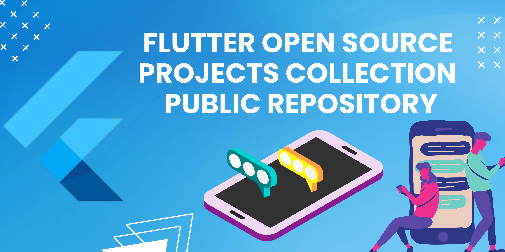

# 🚀 Flutter Open Source Projects Collections

  

  
  
  
  

---

### 🌟 Overview
A curated, comprehensive repository of high-quality, real-world, and public open-source Flutter projects. This collection is designed for developers, researchers, and hobbyists to explore best practices, learn architectural patterns, and contribute to the Flutter ecosystem.

---

## 📑 Table of Contents
- [📱 Featured Projects](#-featured-projects)
- [📂 Categories](#-categories)
- [🛠️ Contributing](#️-contributing)
- [📜 Code of Conduct](#-code-of-conduct)
- [⚖️ License](#-license)

---

## 📱 Featured Projects

| Project | Description | Tech Stack | Link |
| :--- | :--- | :--- | :--- |
| **Flutter Gallery** | Official showcase of widgets & best practices. | `Provider` • `Material` • `Cupertino` | [🔗 Repo](https://github.com/flutter/gallery) |
| **InKino** | Clean architecture movie browsing app. | `BLoC` • `REST API` • `Clean Arch` | [🔗 Repo](https://github.com/roughike/inKino) |
| **Flutter E-Commerce** | Full-featured modern e-commerce UI. | `Bloc` • `Firebase` • `Ui Kit` | [🔗 Repo](https://github.com/TheAlphamerc/flutter_ecommerce_app) |
| **GitTouch** | Open-source GitHub & GitLab client. | `GraphQL` • `Provider` • `Multi-platform` | [🔗 Repo](https://github.com/pd4d10/git-touch) |
| **Open Food Facts** | Sustainable food product scanner. | `Provider` • `Camera` • `REST API` | [🔗 Repo](https://github.com/openfoodfacts/smooth-app) |

---

## 📂 Categories

### 💰 Finance & Fintech
*   **[Money Manager Ex](https://github.com/moneymanagerex/mobile)** — Feature-rich financial management tool. 
    *   `SQLite` • `Provider` • `Charts`

### 🛒 E-commerce & Retail
*   **[WooCommerce Flutter](https://github.com/woocommerce/woocommerce-flutter-app)** — Official app for WooCommerce stores.
    *   `REST API` • `WP-Integration`
*   **[Flutter E-Commerce UI](https://github.com/TheAlphamerc/flutter_ecommerce_app)** — Sleek retail experience.
    *   `Bloc` • `Firebase`

### 📱 Social Media & Communication
*   **[Delta Chat](https://github.com/deltachat/deltachat-flutter)** — Messaging via email (privacy-focused).
    *   `Protocol` • `Encryption`
*   **[GitTouch](https://github.com/pd4d10/git-touch)** — The mobile version of social coding.
    *   `GraphQL` • `Provider`

### 🛠️ Utility & Productivity
*   **[Flutter Gallery](https://github.com/flutter/gallery)** — The ultimate widget reference.
*   **[InKino](https://github.com/roughike/inKino)** — High-performance cinema app.

### 🎮 Games & Entertainment
*   **[Flame Examples](https://github.com/flame-engine/flame/tree/main/examples)** — Showcasing the Flame game engine.
    *   `GameLoop` • `Sprites`
*   **[Flutter Puzzle Hack](https://github.com/flutter/puzzle-hack)** — Complex sliding puzzle logic.
    *   `Animations` • `Bloc`

---

## 🛠️ Contributing

We ❤️ contributions! Whether it's a bug fix, new project addition, or better documentation.

1.  **Fork** the project.
2.  **Add your project** to the relevant category.
3.  Ensure your project is **public** and **well-documented**.
4.  **Submit a PR** with a clear description.

See our [Full Contributing Guidelines](./Contributing.md) for more details.

---

## 📜 Code of Conduct

Help us keep this community healthy! Please respect our [Code of Conduct](./Code%20of%20Conduct.md) at all times.

---

## ⚖️ License

Distributed under the **MIT License**. See [LICENSE](./LICENSE) for more information.

---

  <b>Maintained by <a href="https://github.com/Miftah-Fentaw">Miftah Fentaw</a></b>

